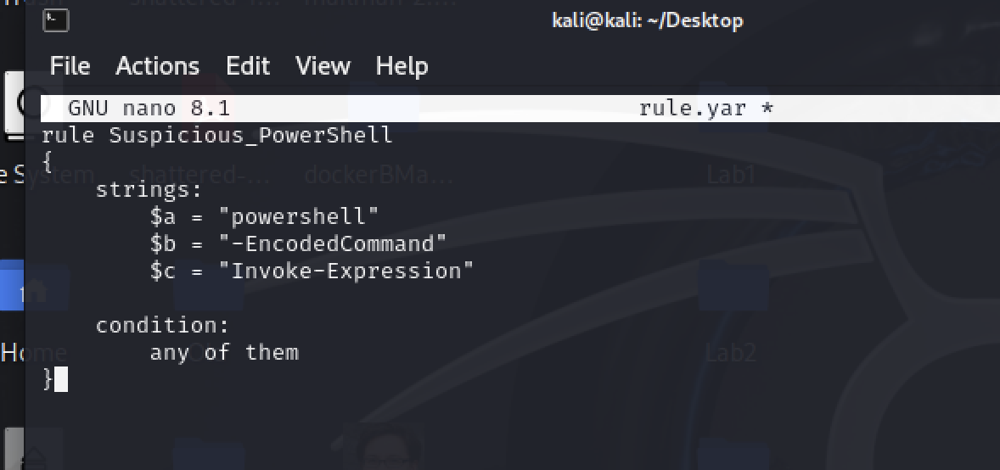
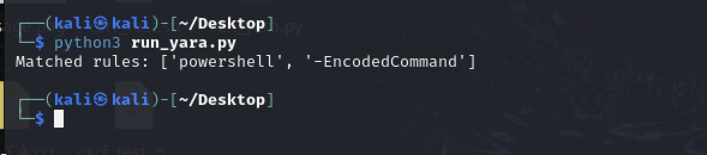
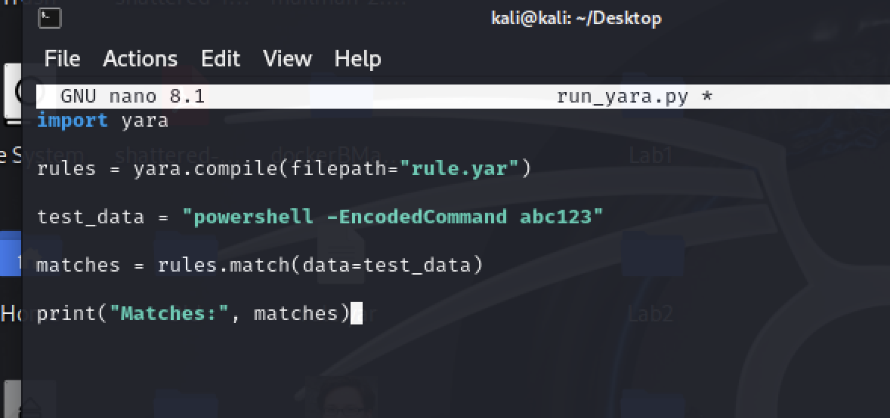

# B17 Implement one of the current state-of-the-art solutions and evaluate it.

For this implementation, I created a small proof-of-concept using YARA, a rule-based threat detection tool used for identifying malicious patterns in files and memory.

A simple YARA-style rule was created and then tested using a Python script to simulate how signature-based detection works in practice.

The script checks input data against predefined indicators such as suspicious PowerShell command patterns. When a match is found, the system outputs a detection result, demonstrating how rule-based security tools identify known malicious behaviour.

We can observe the output of the detection process below:

This implementation shows how YARA operates as a lightweight signature-based detection system. It is effective at identifying known patterns quickly and can be used in malware analysis and threat hunting scenarios.

However, its effectiveness is limited by the fact that it relies on predefined rules, meaning unknown or obfuscated attacks would not be detected unless additional rules are created. Despite this limitation, YARA remains a widely used tool in modern cybersecurity pipelines for early-stage threat detection and static analysis.