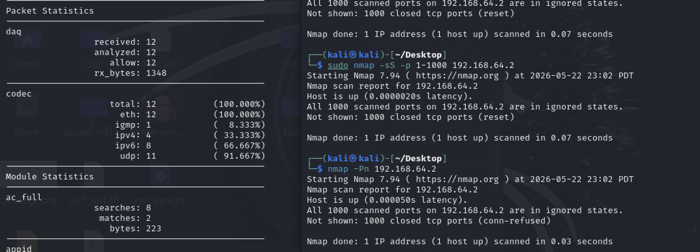

B23 Test an intrusion detection system and discuss its effectiveness.

Snort was deployed in passive IDS mode on interface eth0. During testing, the system successfully captured and analysed live network traffic across multiple protocols including IPv4, IPv6, UDP, and DNS. Built-in modules such as port scan detection and stream tracking were active, demonstrating Snort’s ability to perform real-time traffic inspection and behavioural monitoring.

Network traffic was generated using nmap to simulate behaviour, including ICMP requests and TCP SYN scanning. Snort successfully processed this traffic and recorded it within its internal statistics output.

The results showed active engagement of the port scan detection subsystem and flow tracking engine, confirming that Snort was able to observe and classify network behaviour at the packet level. However, no explicit alert messages were displayed in console output during testing, indicating that default configuration may not always produce visible intrusion alerts without additional rule tuning.

Overall, Snort proved effective as a network intrusion detection system in terms of traffic capture and protocol analysis. It provided detailed visibility into network activity and successfully identified patterns consistent with scanning and probing behaviour.