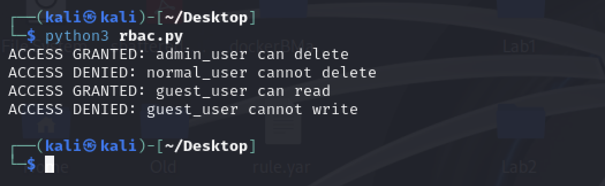

B24 Design and implement access control of your choice.

Role-Based Access Control (RBAC)

RBAC was implemented using a simple Python-based model where users were assigned predefined roles. Each role was mapped to a set of permissions, and access decisions were made by checking whether a user’s role contained the required permission for a requested action.

The system defined three roles:

Admin (full access including delete and user management)
User (standard read/write access)
Guest (read-only access)

Each action request was validated against the permissions assigned to the user’s role before access was granted or denied.

The output demonstrates the RBAC system in action. When different users attempt to perform actions outside their assigned permissions, access is denied, while valid role-permission combinations are allowed. This confirms that the access control logic is correctly enforcing role-based restrictions.