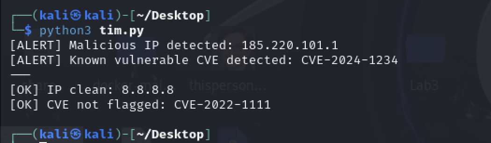

B25 Design and implement a threat intelligence module of your choice.

A simple threat intelligence module was implemented using Python. The system uses a predefined list of known malicious indicators, including IP addresses and CVE identifiers. Incoming activity is checked against this threat intelligence feed, and any matches are flagged as potential threats.

The purpose of this system is to demonstrate how threat intelligence can be used proactively to identify malicious activity before it impacts a system

This approach is conceptually similar to how state-of-the-art cybersecurity systems operate in enterprise environments. For example, Security Information and Event Management (SIEM) platforms and Threat Intelligence Platforms (TIPs) continuously ingest external threat feeds and correlate them with live system logs to identify potential attacks in real time. Similarly, detection rules and queries used in systems like KQL-based Microsoft Defender hunting are built around matching known indicators of compromise and identifying suspicious patterns in behaviour.